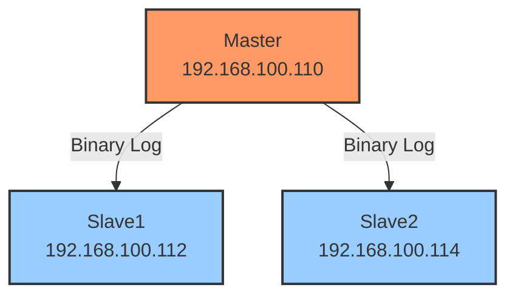
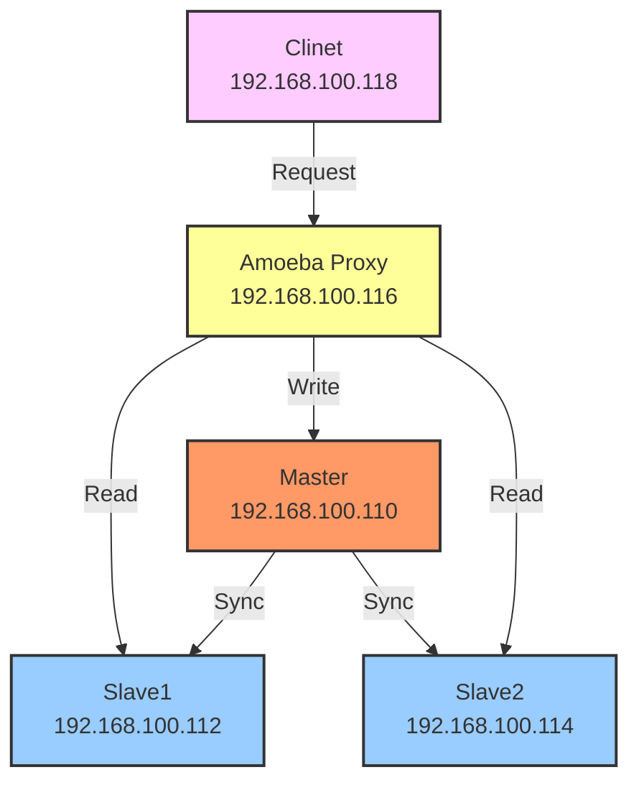

## 项目概述

​	<font style="color:rgb(51, 51, 51);">本项目旨在通过搭建 MySQL **主从复制**架构，并结合中间件实现**读写分离**，提升数据库的读写性能和可用性。主从复制允许数据从主服务器同步到一个或多个从服务器，读写分离则将读操作和写操作分别分配到不同的服务器上，从而**减轻主服务器的负载**。</font>

## 架构设计图
### 主从复制

原理解释：

1. Master节点将数据的改变记录成二进制日志（bin log），当Master上的数据发生改变时，则将其改变写入二进制日志中
2. Slave节点会在一定时间间隔内对Master的二进制日志进行探测其是否发生改变，如果发生改变，则开始一个I/O线程请求 Master的二进制事件
3. 同时Master节点为每个I/O线程启动一个dump线程，用于向其发送二进制事件，并保存至Slave节点本地的中继日志（Relay log）中
4. Slave节点将启动SQL线程从中继日志中读取二进制日志，在本地重放，即解析成SQL语句逐一执行，使得其数据和 Master节点的保持一致，最后I/O线程和SQL线程将进入睡眠状态，等待下一次被唤醒。
   




### 读写分离

原理解释：

​	让**主数据库**处理事务性增、改、删操作（INSERT、UPDATE、DELETE），而**从数据库**处理SELECT查询操作。数据库复制被用来把事务性操作导致的变更同步到集群中的从数据库




## 环境准备
### 主机规划 
| 主机名 | IP | 环境 | 角色 |
| --- | --- | --- | --- |
| master | 192.168.100.110 | CentOS 7.9 | MySQL 主服务器 |
| slave1 | 192.168.100.112 | CentOS 7.9 | MySQL 从服务器1 |
| slave2 | 192.168.100.114 | CentOS 7.9 | MySQL 从服务器2 |
| amoeba | 192.168.100.116 | CentOS 7.9 | Amoeba 服务器 |
| client | 192.168.100.118 | Ubuntu22.04 | 客户端 |


### 目录规划
| 服务 | 目录 | 说明 |
| --- | --- | --- |
| MySQL | `/usr/lib/mysql` | MySQL安装目录 |
| Java | `/usr/local/java/jdk1.0.8` | Java环境目录 |
| Amoeba | `/usr/local/amoeba` | Amoeba安装目录 |


## 部署步骤
### 配置必要服务
#### 配置NTP服务
安装NTP服务

```bash
yum install -y ntp ntpdate
```

配置定时任务(每10min同步一次时间)： `crontab -e`

```shell
# ntpdate time for ntp1.aliyun.com
*/10 * * * * /sbin/ntpdate ntp1.aliyun.com >/dev/null 2>&1
```

#### 安装MySQL
下载MySQL5.7 安装包

```bash
wget https://repo.mysql.com/mysql57-community-release-el7.rpm
```

安装MySQL服务

```bash
rpm -ivh mysql57-community-release-el7.rpm
rpm --import https://repo.mysql.com/RPM-GPG-KEY-mysql-2022
yum install -y mysql-community-server
```


配置编码和端口，编辑 `/etc/my.cnf`,添加以下内容

```bash
port=3306
character-set-server=utf8
default-storage-engine=innodb
```

重启MySQL服务

```bash
systemctl start mysqld
```

查看服务运行状态并从日志中获取密码

```bash
systemctl status mysqld.service
grep "password" /var/log/mysqld.log
```


修改密码

```bash
mysql -u root -p
ALTER USER 'root'@'localhost' IDENTIFIED BY 'Admin@123';
```


### 主从复制
#### 对Master进行配置
编辑 `/etc/my.cnf`

```bash
server-id = 1
log-bin=master-bin                #添加，主服务器开启二进制日志
log-slave-updates=true            #添加，允许从服务器更新二进制日志
binlog_format = MIXED
```

并重启MySQL服务

```bash
systemctl restart mysqld
```

进入MySQL，给从服务器授权等操作

```sql
# 给从服务器授权,创建一个专门用于复制的MySQL用户账户，并授予其复制权限
GRANT REPLICATION SLAVE ON *.* TO 'myslave'@'192.168.100.%' IDENTIFIED BY 'Admin@123';
# 将用户和权限配置保存在内容中,强制MySQL重新加载权限表（Grant Tables），使权限修改立即生效
FLUSH PRIVILEGES;
# 查看master服务器当前正在执行的二进制日志位
show master status;
```


#### 对Slave1进行配置
编辑 `/etc/my.cnf`，并重启MySQL服务

```sql
server-id = 2                                #修改，注意id与Master的不同，两个Slave的id也要不同
relay-log=relay-log-bin                      #添加，开启中继日志，从主服务器上同步日志文件记录到本地
relay-log-index=slave-relay-bin.index        #添加，定义中继日志文件的位置和名称
relay_log_recovery = 1                       #选配项，建议开启
```

进入MySQL，<font style="color:rgba(0, 0, 0, 0.88);">配置主从复制master</font>

```sql
change master to master_host='192.168.100.110' , master_user='myslave',master_password='Admin@123',master_log_file='master-bin.000001',master_log_pos=604;
```

查看Slave状态，必须确保IO 和 SQL 线程都是 Yes，代表同步正常

```sql
START SLAVE;
SHOW SLAVE STATUS\G
```


#### 对Slave2进行配置
编辑 `/etc/my.cnf`，并重启MySQL服务

```sql
server-id = 3                                #修改，注意id与Master的不同，两个Slave的id也要不同
relay-log=relay-log-bin                      #添加，开启中继日志，从主服务器上同步日志文件记录到本地
relay-log-index=slave-relay-bin.index        #添加，定义中继日志文件的位置和名称
relay_log_recovery = 1                       #选配项，建议开启
```

进入MySQL，<font style="color:rgba(0, 0, 0, 0.88);">配置主从复制master</font>

```sql
change master to master_host='192.168.100.110' , master_user='myslave',master_password='Admin@123',master_log_file='master-bin.000001',master_log_pos=604;
```

查看Slave状态，必须确保IO 和 SQL 线程都是 Yes，代表同步正常


#### 对主从复制进行验证
在master节点创建数据库

```sql
create database sky;
show databases;
```

查看从节点的同步情况，验证成功！


### 读写分离
#### 配置Java环境
在Amoeba主机上，下载安装包

```bash
wget https://repo.huaweicloud.com/java/jdk/8u181-b13/jdk-8u181-linux-x64.tar.gz
tar -zxvf jdk-8u181-linux-x64.tar.gz
```

> 华为云开源镜像站：[https://repo.huaweicloud.com/java/jdk/](https://repo.huaweicloud.com/java/jdk/)
>

配置安装目录

```bash
mkdir -p /usr/local/java
cp -r jdk1.8.0_181/ /usr/local/java/jdk1.0.8
```

配置环境变量，编辑`/etc/profile`，在文件末尾加上

```bash
#java 1.0.8
export JAVA_HOME=/usr/local/java/jdk1.0.8
export PATH=$JAVA_HOME/bin:$PATH
export CLASSPATH=.:$JAVA_HOME/lib/dt.jar:$JAVA_HOME/lib
```

手动使环境变量生效，配置成功

```bash
source /etc/profile
[root@amoeba sky]$java -version
java version "1.8.0_181"
Java(TM) SE Runtime Environment (build 1.8.0_181-b13)
Java HotSpot(TM) 64-Bit Server VM (build 25.181-b13, mixed mode)
```

#### 配置Amoeba
> 下载地址：[https://sourceforge.net/projects/amoeba/files/Amoeba%20for%20mysql/2.2.x/](https://sourceforge.net/projects/amoeba/files/Amoeba%20for%20mysql/2.2.x/)
>

解压到对应目录

```bash
mkdir -p /usr/local/amoeba
cd /usr/local/amoeba/
tar -xf /home/sky/amoeba-mysql-binary-2.2.0.tar.gz -C /usr/local/amoeba
chmod -R 755 /usr/local/amoeba/
```

配置环境变量，编辑`/etc/profile`，在文件末加上如下内容:

```bash
# amoeba
export AMOEBA_HOME=/usr/local/amoeba
export PATH=$PATH:$AMOEBA_HOME/bin
```

**手动使环境变量生效**，此时正美美得想着启动，但是它出现了一个报错


解决办法：将/usr/local/amoeba/bin/amoeba文件的第58行

```bash
58 DEFAULT_OPTS="-server -Xms256m -Xmx256m -Xss128k"
```

替换成如下：

```bash
58 DEFAULT_OPTS="-server -Xms256m -Xmx256m -Xss256k"
```

成功启动！


先在master，slave1，slave2分别执行以下语句，授权给Amoeba访问

```bash
grant all on *.* to root@'192.168.100.%' identified by 'Admin@123';
flush privileges;
```

配置`/usr/local/amoeba/conf/{amoeba,dbServers}.xml`，先备份

```bash
cp amoeba.xml{,.bak}; cp dbServers.xml{,.bak}
```

修改文件`amoeba.xml`的第30,32行内容


115gg快速跳转，修改第115,118,119行内容


修改文件`dbServers.xml`的第23,26,29行内容


> 注释一定要对，格式是<!-- -->
>

修改第45,48,52,55行内容，新增slave2，并配置分离主从


运行Amoeba


#### 对读写分离进行验证
登录amoeba

```bash
mysql -u amoeba -p Admin@123 -h 192.168.100.116 -P 8066 --default-character-set=utf8
```

创建一个表，并插入数据

```bash
CREATE TABLE students (
    id INT AUTO_INCREMENT PRIMARY KEY,
    name VARCHAR(20) NOT NULL,
    age INT
);

INSERT INTO students (name, age) VALUES
('张三', 18),
('李四', 19),
('王五', 20);
```

进行查询，正常


关闭slave1或slave2的MySQL服务，发现查询正常，都关闭则无法查询


关闭master节点，发现无法写入，但是可以进行查询


至此，读写分离验证成功！

## 总结

​	在实际的生产环境中，对数据库的读和写都在同一个数据库服务器中，是不能满足实际需求的。无论是在安全性、高可用性还是高并发等各个方面都是完全不能满足实际需求的。因此，通过主从复制的方式来同步数据，再通过读写分离来提升数据库的并发负载能力。

## 参考链接

[MySQL数据库之主从复制与读写分离_CSDN博客](https://blog.csdn.net/weixin_67474417/article/details/125486623)

[启动Amoeba报The stack size specified is too small解决方法](https://developer.aliyun.com/article/546090)
